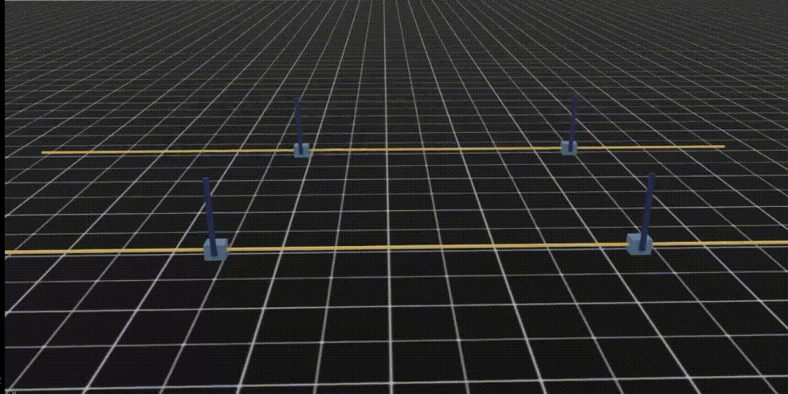
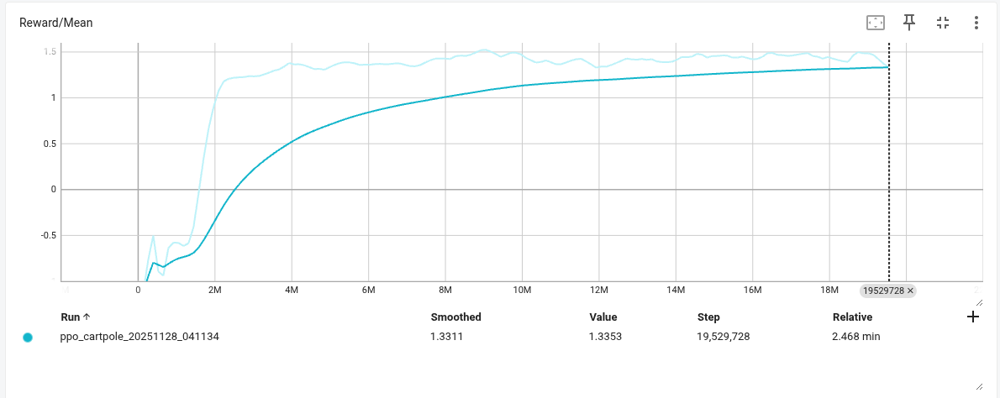
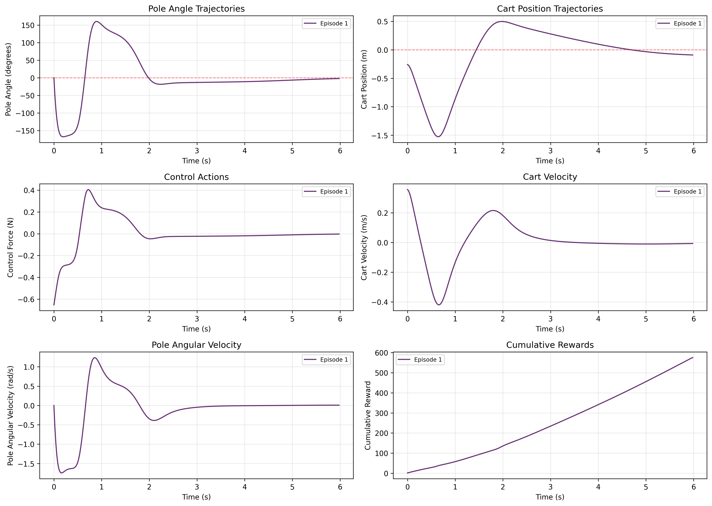

**README.md:**

# CartPole RL Control with PPO

Reinforcement learning solution for balancing an inverted pendulum using Proximal Policy Optimization (PPO) in NVIDIA Isaac Lab.



## What is This?

A cart-pole balancing system that learns to keep a pole upright by applying forces to a moving cart. The AI agent is trained using PPO (Proximal Policy Optimization) with 4096 parallel environments for fast learning.

**System Parameters:**

- Cart mass: 1.0 kg
- Pole mass: 0.2 kg
- Pole length: 0.5 m
- Initial angle: -20° to +20° (random)

## Quick Start

### Train the Agent

```bash
~/IsaacLab/isaaclab.sh -p train_ppo.py --num_envs 4096 --headless
```

Training takes ~5-10 minutes with 4096 parallel environments.

### Test Trained Model

```bash
~/IsaacLab/isaaclab.sh -p test_ppo.py \
    --model ppo_cartpole_best.pth \
    --num_envs 1 \
    --num_episodes 5 \
    --headless
```

### Generate Plots

```bash
python plot_ppo_results.py
```

## Results

### Training Progress



The agent learns to balance the pole within 200-500 iterations.

### Evaluation Results



The trained policy successfully stabilizes the pole with smooth control actions.

## Project Files

| File                    | Description                             |
| ----------------------- | --------------------------------------- |
| `cartpole_sim.py`       | Environment wrapper with custom rewards |
| `ppo.py`                | PPO algorithm implementation            |
| `train_ppo.py`          | Training script                         |
| `test_ppo.py`           | Testing script                          |
| `plot_ppo_results.py`   | Visualization script                    |
| `ppo_cartpole_best.pth` | Trained model weights                   |
| `ppo_hyperever.pth`     | Trained model to test                   |

## Algorithm

**PPO (Proximal Policy Optimization)**

- Actor-Critic architecture
- 4 epochs, batch size 2048
- Learning rate: 3e-4
- Discount factor: 0.99
- Clip epsilon: 0.2

```

```
